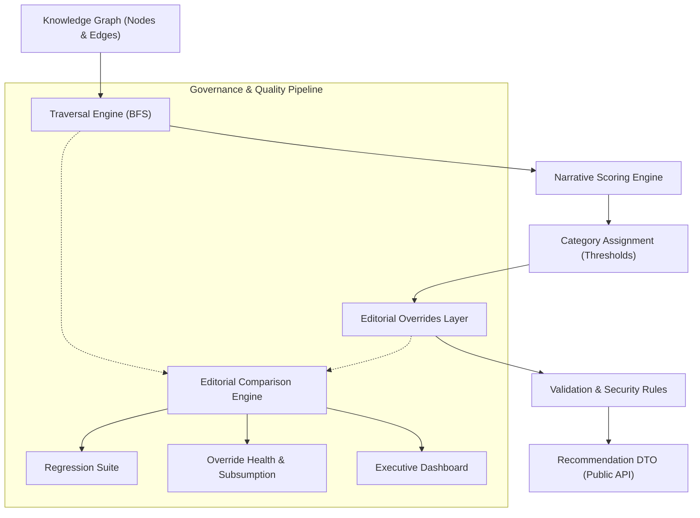

**Framework Status**: `LOCKED` (`v1.0-framework-freeze`) | **Knowledge Graph**: `v3.4` | **Traversal Engine**: `v2.1` | **Policy**: `v6.2`

> 🔒 **PLATFORM FREEZE DIRECTIVE**: CineOrder has transitioned from **Platform Engineering** to **Knowledge Engineering**. The framework runtime (`src/lib/`) is locked. All feature evolution occurs through Knowledge Graph modeling (`src/data/`). Refer to [EDITORIAL_POLICY.md](file:///c:/web/EDITORIAL_POLICY.md) and [GRAPH_STYLE_GUIDE.md](file:///c:/web/GRAPH_STYLE_GUIDE.md).

---

## 0. CineOrder Platform Freeze & Knowledge Engineering Directive

### Status: LOCKED (`v1.0-framework-freeze`)

CineOrder is an **editorial knowledge platform** that produces recommendations. Framework modules are locked to prevent framework creep.

#### Frozen Framework Modules (Modifications Prohibited)
- **Runtime Engines**: Traversal Engine (`src/lib/storyGraphEngine.ts`), BFS algorithms, Recommendation Engine (`src/lib/recommendationEngine.ts`), Recommendation Service, Scoring Engine (`src/lib/narrativeScoring.ts`), Category Thresholds, DTO Generators, Snapshot Pipelines.
- **Governance Tools**: Comparison Engine (`scripts/runEditorialComparison.ts`), Editorial Knowledge Alignment Protocol, Graph Improvement Taxonomy, Override Health Reports, Executive Dashboard.
- **Core Governance Specs**: `ARCHITECTURE.md`, `EDITORIAL_POLICY.md`, `GRAPH_STYLE_GUIDE.md`.

#### Allowed Development Scope
Daily development occurs **exclusively** inside:
- `src/data/` (Graph topology, title nodes, edges, relationships, strengths, metadata, narrative evidence)
- `src/data/editorialOverrides.ts` (Temporary scaffolding overrides)
- Test suites (`src/__tests__/`) and Markdown documentation.
- **Canonical Review Workflow**: Refer to [EDITORIAL_POLICY.md Section 10](file:///c:/web/EDITORIAL_POLICY.md#10-canonical-review-protocol) for transitioning titles from provisional trailer modeling to canonical movie-verified graph refinement upon OTT/home release.

#### Mandatory Governance Rule for Framework Modifications
> ⚠️ **MANDATORY RULE**: Every framework modification MUST first fail at least one complete Editorial Knowledge Alignment cycle.
>
> Framework evolution is strictly prohibited unless ALL five conditions are met:
> 1. Editorial Knowledge Alignment classifies `🟥 FRAMEWORK LIMITATION`.
> 2. The issue cannot be solved by graph topology, relationship selection, edge strength, or narrative evidence.
> 3. A formal RFC documents the modeling limitation.
> 4. Automated regression suite passes with 0 failures.
> 5. Comparison Engine confirms measurable global accuracy improvement.

#### Pull Request Governance Checklist
Every proposed PR must explicitly answer the 7 Governance Questions:
1. What editorial disagreement exists?
2. What measurable evidence supports it?
3. What is the primary root cause?
4. Can the problem be solved through graph modeling?
5. Does the solution preserve the frozen framework?
6. Does the regression suite pass?
7. Does comparison accuracy improve or remain stable?

---

## 1A. Metadata Refresh & Lifecycle Architecture (Requirements 21–32)

### Canonical Data Flow

Every downstream component **must consume the canonical state**. No downstream component may invent its own lifecycle state.

```
             CANONICAL CATALOG (src/data/franchises/)
                    │
                    ▼
          METADATA VERIFICATION (classifyLifecycle, computeOttAvailable)
                    │                          (src/lib/metadataRefresh.ts)
                    ▼
        LIFECYCLE CLASSIFICATION (DetailedLifecycleStatus)
                    │
          ┌─────────┴─────────┐
          ▼                   ▼
   FRANCHISE DATA        OTT AVAILABILITY (isOttAvailable)
          │                   │              (src/lib/upcomingUtils.ts)
          ▼                   ▼
    WATCH ORDERS       RECOMMENDATION MODE
          │                   │
          ▼                   ▼
 KNOWLEDGE GRAPH          MOVIE PAGE
          │
          ▼
 RECOMMENDATION ENGINE
          │
          ├──────────────► FRANCHISE PAGE
          │
          ├──────────────► UPCOMING PAGE
          │
          └──────────────► AI ADVISOR
```

### Canonical Lifecycle State Machine

```
ANNOUNCED → UPCOMING → THEATRICALLY_RELEASED → DIGITAL_AVAILABLE → SUBSCRIPTION_AVAILABLE
```

Transitions happen automatically via change detection in `refreshMetadata()` using these rules:
1. `theatrical_release_date <= today` → `theatrical_released = true`, `status = 'released'`
2. `digital_release_date <= today` → `digital_available = true`, `ott_available = true`
3. `subscription_streaming_release_date <= today` → `subscription_streaming_available = true`, `ott_available = true`
4. Verified streaming provider present → `ott_available = true`

### Canonical OTT Availability Rule (Immutable)

```
ott_available = digital_available OR subscription_streaming_available
```

- Implemented in: `computeOttAvailable(item: Content)` → `src/lib/metadataRefresh.ts`
- UI gate: `isOttAvailable(item)` → `src/lib/upcomingUtils.ts`
- **UI components MUST call `isOttAvailable()` — never read `item.ott_available` directly.**

### Canonical Lifecycle Classification

Single source of truth: `classifyLifecycle(item, asOfDate?)` → `src/lib/metadataRefresh.ts`

Used by:
- `refreshMetadata()` (batch update pipeline)
- `buildContent()` (data construction helper)
- `validateDatasetIntegrity()` (validator checks #15, #16)

### Metadata Freshness Thresholds

| Threshold | Value | Behavior |
|---|---|---|
| `METADATA_FRESHNESS_WARNING_DAYS` | 30 days | `METADATA_REFRESH_REQUIRED` warning |
| `METADATA_FRESHNESS_ERROR_DAYS` | 90 days | `STALE_RELEASE_DATE` error (when causing UI inconsistency) |

Both constants are exported from `src/types/index.ts`.

### Stale Metadata Validator Checks (Check #15 in `validateDatasetIntegrity()`)

| Code | Severity | Condition |
|---|---|---|
| `STALE_OTT_FLAG` | ERROR | `ott_available` stored ≠ canonical `computeOttAvailable()` result |
| `STALE_DIGITAL_AVAILABILITY` | ERROR | `digital_release_date` is past but `digital_available !== true` |
| `STALE_STREAMING_AVAILABILITY` | ERROR | `subscription_streaming_release_date` is past but `subscription_streaming_available !== true` |
| `STALE_RELEASE_DATE` | ERROR/WARN | `status='upcoming'` but `release_date` is past; ERROR when metadata age > 90d |
| `STALE_LIFECYCLE_STATUS` | ERROR/WARN | Stored `lifecycle_status` disagrees with `classifyLifecycle()`; ERROR when UI-breaking |
| `METADATA_REFRESH_REQUIRED` | WARN | `metadata_checked_at` older than 30 days for released title |

### Release Gate UI Consistency (Check #16 in `validateDatasetIntegrity()`)

The following states are **impossible and will fail the gate**:

| Impossible State | Error Code |
|---|---|
| Theatrically released + in Upcoming section | `THEATRICAL_UPCOMING_MISMATCH` |
| OTT available + `lifecycle_status='upcoming'` (Trailer Readiness) | `OTT_MODE_MISMATCH` |
| Not OTT available + `lifecycle_status='subscription_available'` | `OTT_MODE_MISMATCH` |
| `theatrical_released=true` + `status='upcoming'` | `THEATRICAL_UPCOMING_MISMATCH` |
| `lifecycle_status='subscription_available'` + `ott_available=false` | `STALE_OTT_FLAG` |

### Adding a New Title (Requirement 29 Checklist)

When a developer adds a new title to canonical data, the system automatically validates all required integration steps. The following must be present or the release gate will fail with an actionable error:

1. ✓ Add to franchise content array (`src/data/franchises/<franchise>.ts`)
2. ✓ Add to franchise index (`src/data/franchises/index.ts`)
3. ✓ Add to Release Watch Order
4. ✓ Add to Chronological Watch Order
5. ✓ Add `TitleNode` to Knowledge Graph (`src/data/cineOrderKnowledgeGraph.ts`)
6. ✓ Set correct lifecycle fields (`status`, `theatrical_release_date`, `ott_available`, etc.)
7. ✓ Run `npm run release:gate` — must PASS before merging

**The system will automatically detect everything that is missing and report the exact integration step.**

### Available Commands

| Command | Purpose |
|---|---|
| `npm run audit:metadata` | Full per-title metadata freshness audit with tabular report |
| `npm run release:gate` | 4-gate release gate validation (A: Data, B: Lifecycle/UI, C: Integration, D: Recommendations) |
| `npm run validate:recommendations` | Recommendation completeness validation |

### No-Hardcode Rule (Requirement 27)

**NEVER** write:
```ts
if (title.id === 'some-movie') ...   // ❌ PROHIBITED
if (date === '2026-08-04') ...        // ❌ PROHIBITED
```

All lifecycle behavior must be derived from canonical metadata via `classifyLifecycle()` and `isOttAvailable()`.

---

## 1. System Architecture Overview

CineOrder separates graph traversal, narrative scoring, editorial intent, and comparison governance into decoupled layers:



---

## 2. How to Add a New Title Node

Titles are defined in `src/data/cineOrderKnowledgeGraph.ts` under `titleNodes`.

### Required Properties

```ts
'mcu-ironman': {
  id: 'mcu-ironman',
  title: 'Iron Man',
  releaseDate: '2008-05-02',
  franchise: 'mcu',
  type: 'movie',
  phase: 'Phase 1',
  protagonists: ['tony-stark'],
  antagonists: ['obadiah-stane'],
  importance: 'critical', // 'critical' | 'major' | 'moderate' | 'minor'
  depth: 'full_view',     // 'full_view' | 'glance' | 'skippable'
  incomingEdges: [],
  outgoingEdges: [],
}
```

---

## 3. Creating Graph Edges & Choosing Relationship Types

Edges connect a `sourceId` (prerequisite/context item) to a `targetId` (watched/queried item).

### Edge Schema

```ts
{
  sourceId: 'mcu-captain-america-1',
  targetId: 'mcu-avengers',
  relationship: 'character-origin', // CKGEdgeRelationship
  strength: 'required',             // CKGEdgeStrength
}
```

### Relationship Matrix

| Relationship | Base Score | When to Use |
|---|---|---|
| `direct-sequel` | 95 | Direct narrative continuation of the previous film/show. |
| `story-continuation` | 85 | Picks up a primary plot line or major unresolved arc. |
| `character-origin` | 75 | Introduces a key protagonist/antagonist for the target item. |
| `character-development` | 75 | Essential character arc transformation relevant to target. |
| `major-crossover` | 75 | Large assembly event connecting multiple franchises/teams. |
| `timeline` / `multiverse` | 65 | Establishes chronological sequence or multiversal rules. |
| `world-building` | 50 | Expands universe lore, organizations, or mechanics. |
| `organization` | 50 | Establishes groups (e.g. S.H.I.E.L.D., Jedi Order). |
| `thematic-callback` | 45 | Visual/narrative homage without direct plot dependency. |
| `same-universe-only` | 30 | Shares a universe but has zero direct plot overlap. |
| `post-credit` | 40 | Teaser scene setting up future events. |

### Strength Levels

- `required` (100 pts) — Absolute prerequisite; target cannot be understood without it.
- `strong` (80 pts) — Highly recommended context; significantly enriches viewing.
- `moderate` (60 pts) — Useful extra background; nice to have.
- `post-credit` (40 pts) — Post-credit scene teaser context.
- `weak` (20 pts) — Loose connection or universe background.

---

## 4. Editorial Overrides Policy

The engine should naturally produce accurate recommendations. Overrides are exceptions, not primary logic.

### When to Use Overrides
- **Unreachable Nodes**: Prerequisite is >3 BFS hops away or outside standard traversal scope.
- **Subjective Editorial Intent**: Specific franchise nuances that cannot be inferred purely from graph topology.

### When NOT to Use Overrides
- Do NOT use overrides to patch score boundary flips (`optional` vs `recommended`) that can be fixed by adjusting edge strength in the graph.

---

## 5. Running the Comparison & Governance Suite

Execute the global comparison framework via CLI:

```bash
# Run global comparison report and display Executive Summary
npx tsx scripts/runEditorialComparison.ts

# Export CSV and JSON reports
npx tsx scripts/runEditorialComparison.ts --csv --json

# Run single-title deep analysis
npx tsx scripts/runEditorialComparison.ts --target mcu-avengers

# Simulate score adjustments without changing source code
npx tsx scripts/runEditorialComparison.ts --simulate "character-origin=-5,world-building=-4"
```

---

## 6. Executive Health Dashboard Interpretation

Running the suite prints the ASCII Executive Summary:

```text
========================================
 Recommendation Engine Health           
========================================
 Generated............... 2026-08-06
 Knowledge Graph......... v3.4
 Traversal Engine........ v2.1
 Policy Version.......... v6.2
 Comparison Engine....... v1.0
 Git Commit.............. local-dev
 Execution Duration...... 19ms
 --------------------------------------
 Overall Accuracy........ 94.8%
 Average Drift........... 0.10
 Override Effectiveness.. 19%
 Active Overrides........ 19 (+0)
 Redundant Overrides..... 81 (81 definitely removable)
 Necessary Overrides..... 1
 Likely Necessary........ 5
 Calibration Priority.... None
 Engine Status........... Stable
========================================
```

### Data-Driven Status Thresholds

| Status | Accuracy Threshold | Drift Threshold | Meaning |
|---|---|---|---|
| **Excellent** | $\ge 98\%$ | $\le 0.05$ | Outstanding alignment; minimal overrides needed. |
| **Healthy** | $\ge 95\%$ | $\le 0.15$ | Production-ready engine alignment. |
| **Stable** | $\ge 90\%$ | $\le 0.20$ | Solid baseline; minor boundary flips. |
| **Needs Calibration** | $< 90\%$ | $> 0.20$ | Requires relationship/edge score review. |
| **Unstable** | Any | $> 1.00$ | Large systemic category drift; halt changes. |

---

## 7. Editorial Knowledge Alignment Protocol

Instead of treating overrides as permanent patches, the **Editorial Knowledge Alignment Protocol** views every override as a temporary learning scaffolding. The goal is to teach the Knowledge Graph to naturally produce the editorial recommendation without modifying framework traversal or scoring.

### Closed-Loop Architecture (Zero Framework Creep Enforced)

```text
  Editorial Policy (EDITORIAL_POLICY.md)
          │
          ▼
  Knowledge Graph (src/data/)  ◄──────────────────────────┐
          │                                              │
          ▼                                              │
  Traversal Engine (FROZEN - Zero Framework Creep)       │
          │                                              │
          ▼                                              │
  Recommendation Output                                  │
          │                                              │
          ▼                                              │
  Comparison Engine (scripts/runEditorialComparison.ts) │
          │                                              │
          ▼                                              │
  Editorial Knowledge Alignment Protocol                │
          │                                              │
          ▼                                              │
  Graph Improvement Action ──────────────────────────────┘
```

### Standardized Graph Improvement Vocabulary

Every graph improvement proposal must use a standardized action type from the fixed taxonomy:

| Action Type | Description | Mandatory Fields |
| :--- | :--- | :--- |
| `EDGE_STRENGTH_CHANGE` | Adjust edge strength weight. | `Location`, `Old`, `New` |
| `RELATIONSHIP_CHANGE` | Change taxonomy relationship type. | `Location`, `Old`, `New` |
| `EDGE_ADDITION` | Insert missing edge between nodes. | `Location`, `Relationship`, `Strength` |
| `EDGE_REMOVAL` | Remove invalid or non-existent dependency edge. | `Location`, `Reason` |
| `NARRATIVE_EVIDENCE_UPDATE` | Expand narrative text/rationale without changing score. | `Location`, `AddedEvidence` |

### Evidence-First 7-Step Diagnostic Flow

1. **Measurable Evidence Collection**: Extract engine score/category vs editorial score/category, category drift metric, and single-title accuracy.
2. **Decision Path Breakdown**: Trace every scoring contribution (relationship base, edge strength weight, depth penalty, character overlap boost).
3. **Editorial Policy Evaluation**: Audit against the Seven Golden Principles in `EDITORIAL_POLICY.md`.
4. **Root Cause Classification**: Select exactly ONE **Primary Cause** and optionally record **Secondary Factors**:
   - **Primary Root Cause Categories**:
     - **A. Missing Graph Edge**: Narrative dependency exists but edge is missing.
     - **B. Wrong Relationship Type**: e.g., `world-building` instead of `story-continuation`.
     - **C. Wrong Edge Strength**: e.g., `moderate` instead of `strong`.
     - **D. Missing Narrative Evidence**: Edge exists but rationale/evidence lacks depth.
     - **E. Score Naturally Correct**: Engine is editorially sound; override is unnecessary.
     - **F. Genuine Editorial Exception**: Subjective nuance that cannot be modeled in graph topology.
   - **Secondary Factors (optional)**: Record secondary contextual drivers without diluting the primary fix.
5. **Standardized Graph Improvement Proposal**: Target only the primary cause using the fixed vocabulary (`EDGE_STRENGTH_CHANGE`, `RELATIONSHIP_CHANGE`, etc.).
6. **Engine Behavior Prediction**: Predict expected score, category, and drift after graph improvement.
7. **Override Final Classification**:
   - `✅ ENGINE ALREADY CORRECT` — Delete override permanently.
   - `🟨 GRAPH IMPROVEMENT REQUIRED` — Update graph data, re-verify, then delete override.
   - `🟧 EDITORIAL EXCEPTION` — Retain override; document why engine should not learn this exception.
   - `🟥 FRAMEWORK LIMITATION` — Document specific modeling limitation for future RFC.

### Standardized Report Output Format

```text
========================================
Editorial Knowledge Alignment Report
========================================
Target:                         ...
Source:                         ...

1. Measurable Evidence:
   • Engine Score / Category:    ...
   • Editorial Score / Category: ...
   • Category Drift:             ...

2. Decision Path & Policy Audit:
   • Decision Path Breakdown:    ...
   • Policy Principles Applied:  ...

3. Root Cause Analysis:
   • Primary Root Cause:         ...
   • Secondary Factors:          ...

4. Standardized Graph Improvement:
   • Type:                       [ EDGE_STRENGTH_CHANGE | RELATIONSHIP_CHANGE | EDGE_ADDITION | EDGE_REMOVAL | NARRATIVE_EVIDENCE_UPDATE ]
   • Location:                   ... -> ...
   • Old:                        ...
   • New:                        ...

5. Behavior Prediction & Outcome:
   • Expected Engine Score:      ...
   • Expected Category:          ...
   • Expected Drift:             ...
   • Override Decision:          [ ENGINE ALREADY CORRECT | GRAPH IMPROVEMENT REQUIRED | EDITORIAL EXCEPTION | FRAMEWORK LIMITATION ]
   • Confidence:                 [ High | Medium | Low ]
========================================
```

### 7.6 Canonical Review Protocol Integration
When a title transitions from theatrical/trailer status to fully reviewable (OTT/home release), it undergoes the **Canonical Review Protocol** documented in [EDITORIAL_POLICY.md Section 10](file:///c:/web/EDITORIAL_POLICY.md#10-canonical-review-protocol).

The Canonical Review integrates directly into Knowledge Engineering governance:
- **Refines Provisional Edges**: Converts `strongly-implied` / `provisional` trailer edges to `confirmed` or removes disproven links.
- **Enforces 5-Consequence Validation**: Audits edges against Plot, Character, World, Artifact/Tech, and Emotional consequences.
- **Zero Framework Creep**: Replaces trailer assumptions with movie-verified graph topology without modifying runtime traversal logic.

---

---

## 8. Franchise Completion Quality Gate Criteria

Before tagging a franchise Knowledge Graph (e.g. `MCU v1.0`, `StarWars v1.0`) as **Complete**, it must pass the following release gate:

```text
========================================
   FRANCHISE RELEASE GATE CRITERIA
========================================
✓ Overall Engine Accuracy        ≥ 95.0%
✓ Average Category Drift          ≤ 0.15
✓ Regression Suite               PASS (0 failures)
✓ Editorial Alignment            Complete for 100% of title nodes
✓ Zero Unexplained Scaffolding   Every remaining active override is explicitly classified as:
                                   • 🟧 EDITORIAL EXCEPTION, or
                                   • 🟥 FRAMEWORK LIMITATION
========================================
```

This guarantees that no release ships with unexplained temporary scaffolding. Every remaining override has a documented reason to exist.

---

## 9. Simplified Content Production Roadmap

Following `v1.0-framework-freeze`, all future milestones represent **content production mode**. No new infrastructure milestones are permitted.

```text
v1.1  ──▶ MCU Editorial Knowledge Alignment
  │
  ▼
v1.2  ──▶ MCU v1.0 Release (Release Gate Verified)
  │
  ▼
v2.0  ──▶ Star Wars Knowledge Graph (Skywalker Saga, Mandoverse, Animation)
  │
  ▼
v3.0  ──▶ DC Multiverse Knowledge Graph (DCU, Elseworlds, Animated Universe)
  │
  ▼
v4.0  ──▶ Harry Potter & Wizarding World Knowledge Graph
  │
  ▼
v5.0  ──▶ Middle-earth Legendarium Knowledge Graph (LOTR, Hobbit, Silmarillion)
```

Everything past `v1.0-framework-freeze` is strictly **Knowledge Engineering**.

---

## 10. Core Contributor Discipline

Whenever tempted to modify runtime code in `src/lib/`, ask one governing question:

> **"Can this behavior be expressed through the Knowledge Graph instead?"**
>
> * **IF YES**: Do NOT touch the framework. Express the behavior via graph topology, relationship selection, edge strength, or narrative evidence in `src/data/`.
> * **IF NO**: Run the **Editorial Knowledge Alignment Protocol** to empirically prove `🟥 FRAMEWORK LIMITATION` before introducing any framework proposal.

---

## 10. Editorial Consistency Framework

As new franchises are integrated, narrative scoring boundaries must adhere to consistent domain rules across all universes:

- **Must Watch (`≥95` / `required`)**: Prerequisite events or foundational origins without which the target title is incomprehensible.
- **Recommended (`≥78` / `strong`)**: Core character transformations, major crossover setups, or direct story continuations.
- **Extra Context (`≥50` / `moderate`)**: Broader world-building, lore mechanics, or non-essential origin background.
- **Safe To Skip (`<50` / `weak`)**: Distant universe context or loose thematic callbacks.

---

## 11. Zero Framework Creep Rule

**Golden Governance Rule**: No new framework features, engine refactors, or scoring weight changes may be added unless a concrete content modeling failure explicitly demands it.

### Engineering & PR Policy
Any proposed pull request modifying `src/lib/` framework logic must begin by identifying the specific content case that **cannot** be modeled with the existing architecture.

### Content Modeling Decision Tree

```text
Need to model new content
        │
        ▼
Can it be represented using the existing
relationships, strengths, and editorial policy?
        │
   Yes ─┴─► Add graph data only (src/data/)
        │
        ▼
No
        │
        ▼
Document the specific content limitation
        │
        ▼
Design the smallest sufficient framework change
        │
        ▼
Run regression + comparison suite
        │
        ▼
Merge
```

