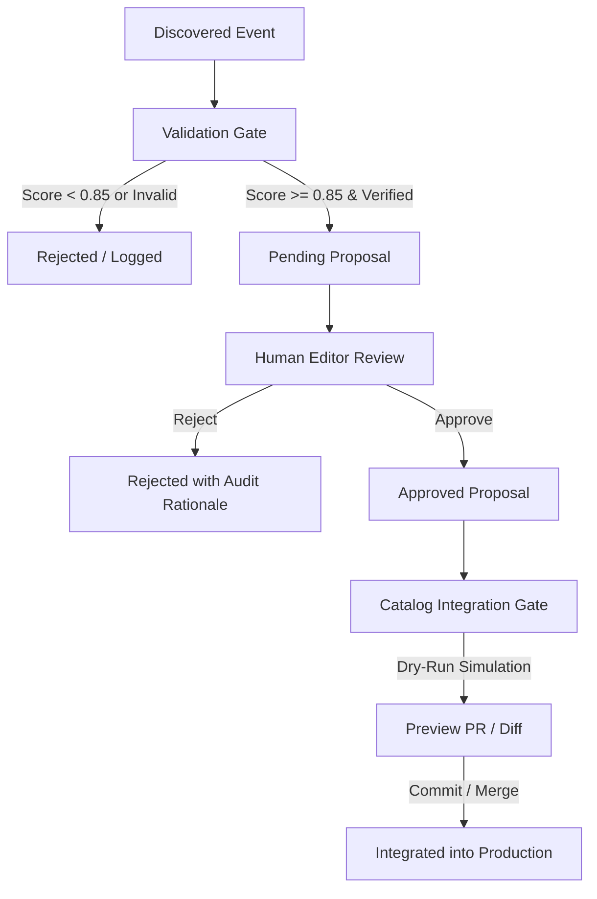

# CineOrder Production Operations & Autonomous Content Maintenance Manual

This manual governs the autonomous content discovery, proposal generation, human review, integration, and diagnostic workflows for CineOrder in production.

---

## 1. System Overview & Core Invariants

CineOrder operates under a strict **Zero Direct Mutation** policy:

$$\text{Discovery} \longrightarrow \text{Validation} \longrightarrow \text{Proposal} \longrightarrow \text{Human Review} \longrightarrow \text{Approval} \longrightarrow \text{Integration} \longrightarrow \text{Validation}$$

### Core Operational Invariants:
1. **Zero Unapproved Mutations:** Monitoring runs discover and queue candidate changes in the Review Center. No catalog item or CKG edge is modified automatically.
2. **Frozen Framework Integrity:** Core engines (`storyGraphEngine.ts`, `storyKnowledgeGraphEngine.ts`, `recommendationService.ts`, `cineOrderKnowledgeGraph.ts`, `.agents/AGENTS.md`) are cryptographically locked and never modified during normal content maintenance.
3. **Multi-Continuity Firewall:** Distinct continuities (e.g. Earth-616 MCU vs Sony Spider-Verse vs Sam Raimi Spider-Man) are strictly separated. Cross-continuity links are allowed only as labeled Multiverse references.
4. **Anti-Inflation Safeguard:** Easter eggs, visual callbacks, and minor cameos are strictly capped at `OPTIONAL` and never escalate to `MUST WATCH`.
5. **Deterministic Idempotency:** Repeated scans of unchanged titles or trailers produce 0 duplicate proposals and 0 state drift.

---

## 2. Autonomous Monitoring Engine

### 2.1 Scheduled & Manual Execution
The autonomous monitor runs daily via GitHub Actions (`.github/workflows/announcement-monitor.yml`) at **04:00 UTC** and can be manually dispatched at any time:

```bash
# Run announcement monitoring locally
npm run monitor:announcements

# Run in dry-run mode
npm run monitor:announcements -- --dry-run
```

### 2.2 Detected Event Types
The engine scans for 11 distinct real-world lifecycle events:
- `NEW_MOVIE`: Newly announced or discovered theatrical feature.
- `NEW_SERIES`: Newly announced or discovered episodic television series.
- `NEW_ANIMATED_TITLE`: Newly announced or discovered animated feature or series.
- `RELEASE_DATE_CHANGE`: Postponed, advanced, or newly announced release date.
- `TITLE_CHANGE`: Official rebranding or subtitle modification.
- `CANCELLATION`: Official project shelving or removal from studio slate.
- `ARTWORK_CHANGE`: Replacement of placeholder artwork with official high-resolution TMDb posters/backdrops.
- `OTT_CHANGE`: Transition of theatrical title to digital/streaming availability.
- `METADATA_CHANGE`: Runtime, rating, cast, director, or synopsis refresh.
- `TRAILER_CHANGE`: Official teaser, trailer, or final trailer discovery / replacement.
- `COMPLETENESS_GAP`: Discovery of omitted prequel, sequel, or historical spin-off.

---

## 3. Proposal Lifecycle & Governance

### 3.1 Proposal Storage & State Transitions
Proposals are stored in the `TrailerIntelligenceStore` and `AnnouncementStore` using serialized storage adapters (LocalStorage for web, MemoryAdapter for headless CI):



### 3.2 Epistemic State & Confidence Scoring
- `OBSERVED`: Raw visual clue detected in official footage (Confidence: 0.85 – 0.95).
- `INFERRED`: Lore connection derived from canon narrative arcs.
- `EDITORIAL`: Curated connection added by human knowledge engineer.
- `VERIFIED`: Confirmed by official studio press release or creator statement (Score: 1.0).

---

## 4. Review Center Operations

### 4.1 Inspecting Proposals & Impact Simulations
Editors navigate to `/admin/ckg-proposals` to inspect queued proposals. For any proposal:
1. View the verified video key, official publisher, and source citation.
2. Inspect extracted observations with timestamped video evidence.
3. Click **Simulate Recommendation Impact** to generate a pure read-only ASCII recommendation tree showing projected prerequisite additions.
4. Verify that cross-continuity edges are properly flagged and isolated.

### 4.2 Approving Proposals
When evidence meets editorial standards:
1. Select **Approve Proposal**.
2. Enter reviewer identification (e.g. `Editorial Lead`) and approval rationale.
3. The proposal status transitions to `approved`.

### 4.3 Rejecting Proposals
When evidence is speculative, unverified, or fan rumor:
1. Select **Reject Proposal**.
2. Enter detailed rejection rationale.
3. The proposal is archived with full audit trail logging and 0 catalog mutation.

---

## 5. Catalog Integration & Rollback

### 5.1 Pre-Flight Integration Gates
Prior to modifying catalog files, `validateProposalForIntegration()` executes 6 automated gates:
1. **Status Gate:** Proposal MUST have `status: 'approved'`.
2. **Credibility Gate:** Source verification score MUST be $\ge 0.85$ with `isVerified: true`.
3. **Franchise Gate:** Target franchise MUST be registered in `allFranchises`.
4. **Duplicate Gate:** Content ID and TMDb ID MUST NOT already exist in catalog.
5. **Lifecycle Gate:** Pre-release titles cannot have `ottAvailable: true`.
6. **Artwork Gate:** Valid poster and backdrop URLs MUST be present.

### 5.2 Atomic Dry-Run & Merge
```typescript
import { integrateApprovedProposal } from '@/lib/catalogIntegrationService';

// Dry-run preview
const dryRun = integrateApprovedProposal(approvedPkg, { dryRun: true });

// Production merge
const result = integrateApprovedProposal(approvedPkg, { dryRun: false });
```

### 5.3 Rollback Protocol
If any runtime anomaly occurs post-integration:
1. Revert the corresponding pull request or restore the franchise file from Git:
   ```bash
   git checkout HEAD~1 -- src/data/franchises/<franchise-file>.ts
   ```
2. Re-run validation:
   ```bash
   npm run validate
   npm run release:gate
   ```

---

## 6. Onboarding a New Franchise (Dynamic Scalability)

CineOrder is strictly franchise-agnostic with **zero hard-coded franchise counts**. To register a new franchise:

1. **Create Franchise Data File:** `src/data/franchises/<franchise-name>.ts`:
   ```typescript
   export const myFranchise: Franchise = { ... };
   export const myContent: Content[] = [ ... ];
   export const myWatchOrders: WatchOrder[] = [ ... ];
   ```
2. **Export in Franchise Index:** Add to `src/data/franchises/index.ts`:
   - Add to `allFranchises` array.
   - Add to `allContent` array.
   - Add to `franchiseModuleMap`.
3. **Map in Catalog Integration Service:** Add entry to `FRANCHISE_FILE_MAP` in `src/lib/catalogIntegrationService.ts`.
4. **Verify Dynamic Audits:**
   ```bash
   npx tsx scripts/runAllTests.ts
   npm run release:gate
   ```
   The new franchise automatically participates in search, watch orders, recommendation traversal, and autonomous monitoring without framework code changes.

---

## 7. Diagnostic Playbooks

### 7.1 Diagnosing Release Order Anomalies
- **Symptom:** Titles displaying out of chronological order in release tracks.
- **Diagnostic Step:**
  1. Inspect `release_date` format in `src/data/franchises/<franchise>.ts`.
  2. Verify date conforms to ISO-8601 `YYYY-MM-DD`.
  3. Ensure release tracks use `sortWatchOrdersByReleaseDate()`.
  4. Run release order validation:
     ```bash
     npx tsx scripts/verifyProductionBaseline.ts
     ```

### 7.2 Diagnosing Recommendation / Traversal Anomalies
- **Symptom:** Missing prerequisites or unexpected recommendations.
- **Diagnostic Step:**
  1. Verify target `TitleNode` exists in `src/data/cineOrderKnowledgeGraph.ts`.
  2. Inspect connected `StoryEdges` for valid `sourceId` and `targetId`.
  3. Confirm `relationship` and `strength` match intended narrative dependency (`direct-sequel`, `prequel`, `shared-character`).
  4. Run recommendation validation audit:
     ```bash
     npm run validate:recommendations
     ```

### 7.3 Diagnosing Artwork Fallback Issues
- **Symptom:** Broken poster images on title cards.
- **Diagnostic Step:**
  1. Verify poster URL uses secure HTTPS protocol (`https://image.tmdb.org/t/p/w500/...`).
  2. If TMDb image is missing, assign `/placeholder-poster.svg`.
  3. Verify `SafeImage` component wraps the poster rendering.

### 7.4 Diagnosing Corrupted Storage State
- **Symptom:** Local proposal store fails to parse in browser.
- **Diagnostic Step:**
  1. Open DevTools Application tab -> LocalStorage -> clear `cineorder_trailer_intelligence_state`.
  2. Reload the page; `TrailerIntelligenceStore` automatically recovers to pristine baseline state.

---

## 8. Verification & Release Gates

Always run the full release gate verification suite before deploying:

```bash
# 1. Full regression test suite
npx tsx scripts/runAllTests.ts

# 2. Standalone smoke test
npx tsx scripts/productionSmokeTest.ts

# 3. TypeScript validation
npx tsc --noEmit

# 4. Global dataset & recommendation audit
npm run validate

# 5. Formal release gate check (7 gates)
npm run release:gate

# 6. Production bundle build
npm run build

# 7. Cryptographic frozen framework checksum verification
npx tsx scripts/verifyFrozenFramework.ts
```

All 7 release gates must report `PASS` prior to production release.
