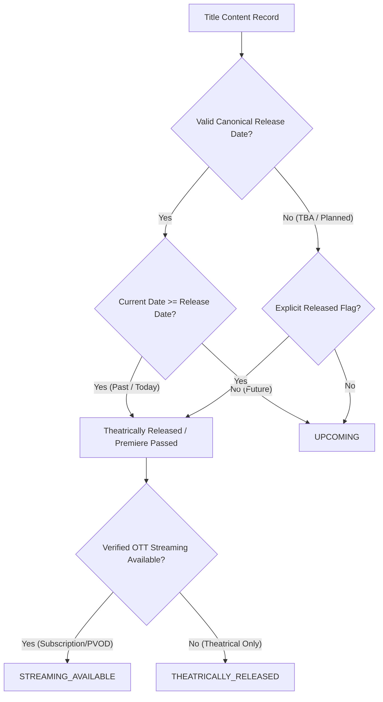

# CineOrder — Date-Aware Lifecycle & Universal Release-State Audit Report

**Date of Audit**: August 20, 2026  
**Status**: COMPLETE & VERIFIED  
**Integrity**: 5/5 Frozen Framework Files Bit-for-Bit Identical  
**Catalog Invariant**: 0 Stale `UPCOMING` Violations across 240 Canonical Titles  

---

## 1. Executive Summary & Root Cause Diagnostic

### The Issue
"Supergirl: Woman of Tomorrow" (`dc-supergirl`) premiered canonically on **June 26, 2026**. On the current evaluation date (**August 20, 2026**), the title was still evaluating to `lifecycleCategory === 'UPCOMING'` and appearing in upcoming filters despite being 55 days post-premiere.

### Diagnostic Trace & Root Cause
A comprehensive audit of the lifecycle evaluation pipeline identified that static catalog fields authored before release were improperly taking precedence over calendar date arithmetic:

1. **`src/lib/metadataRefresh.ts` (`classifyLifecycle`)**:
   - Lines 143–146 previously contained:
     ```typescript
     else if (item.theatrical_released === true) {
       isTheatricallyReleased = true;
     } else if (item.theatrical_released === false) {
       isTheatricallyReleased = false;
     }
     ```
   - Because seed data authored pre-release had `theatrical_released: false`, the branch `item.theatrical_released === false` executed **before** `isPastDate(releaseDate)`. This completely intercepted past dates and hard-locked titles into an unreleased state.
2. **`src/lib/metadataRefresh.ts` (`computeOttAvailable`)**:
   - Line 86 contained `&& item.theatrical_released !== false` in its release verification check. This blocked valid provider inspection for released titles if the static boolean had not been manually toggled.
3. **`src/data/franchises/utils.ts` (`buildContent`)**:
   - Lines 93–99 strictly honored `theatrical_released !== undefined ? theatrical_released : ...` at object construction time, baking static booleans into in-memory Content records.

---

## 2. The Authoritative Date-Based Lifecycle Architecture

We established a single, authoritative, date-aware lifecycle rule across CineOrder that guarantees deterministic behavior without manual catalog toggling:



### Formal Rules Enforced:
1. **Primary Authority of Canonical Date**:
   - For all titles with a valid known release date (`theatrical_release_date || release_date`):
     - `IF currentDate >= releaseDate` $\rightarrow$ Title is **RELEASED** (`THEATRICALLY_RELEASED` or `STREAMING_AVAILABLE`). Stale static flags (`status: 'upcoming'`, `theatrical_released: false`) **MUST NOT** override reality.
     - `IF currentDate < releaseDate` $\rightarrow$ Title is **UPCOMING** (`UPCOMING`).
2. **TBA / Unscheduled Protection**:
   - For titles with `release_date: 'TBA'` or missing dates, CineOrder **never infers or fabricates dates**. TBA titles strictly remain `UPCOMING` / `announced`.
3. **OTT Streaming Distinction**:
   - A theatrically released movie without verified digital/subscription streaming remains `THEATRICALLY_RELEASED` (In Theaters) and is **never** prematurely marked as `STREAMING_AVAILABLE`.
   - When verified streaming providers or flags exist, it seamlessly transitions to `STREAMING_AVAILABLE`.
4. **Timezone & Market Boundary Handling**:
   - Standardized calendar-date arithmetic via `getMarketReleaseDate()` and `isPastDate()` accounts for global broadcast releases (e.g. US ET 9:00 PM $\rightarrow$ Next-Day IST) without day-shift regressions.

---

## 3. Code Modifications Summary

### 1. `src/lib/metadataRefresh.ts`
- Made `classifyLifecycle` evaluate `isPastDate(normReleaseDate, asOfStr)` as primary authority whenever a valid release date is present.
- Updated `computeOttAvailable` to verify past release dates dynamically while preserving Rule 2 explicit unavailability protection.

### 2. `src/data/franchises/utils.ts`
- Updated `buildContent` to calculate `isTheatricallyReleased`, `resolvedStatus`, and `computedLifecycle` dynamically based on date validity.

### 3. `src/__tests__/dateAwareLifecycleRegression.test.ts`
- Created a permanent, 18-scenario master regression suite covering future movies, today's releases, past movies with/without OTT, TBA titles, series, stale status resolution, timezone boundaries, upcoming page filtering, UI surfaces, and catalog-wide invariants.

---

## 4. Verification Results & Test Ledger

### Dedicated Lifecycle Regression Suite (`dateAwareLifecycleRegression.test.ts`)
| Scenario | Description | Result |
| :--- | :--- | :--- |
| **A** | Future movie (`releaseDate > today` $\rightarrow$ `UPCOMING`) | ✅ PASS |
| **B** | Today's movie (`releaseDate === today` $\rightarrow$ `THEATRICALLY_RELEASED`) | ✅ PASS |
| **C** | Past movie (`releaseDate < today` $\rightarrow$ `NOT UPCOMING`) | ✅ PASS |
| **D** | Past movie with no OTT (`releaseDate < today`, `OTT=false` $\rightarrow$ `THEATRICALLY_RELEASED`, not streaming) | ✅ PASS |
| **E** | Past movie with verified OTT (`releaseDate < today`, `OTT=true` $\rightarrow$ `STREAMING_AVAILABLE`) | ✅ PASS |
| **F** | TBA movie (`releaseDate = TBA` $\rightarrow$ `UPCOMING`, no date hallucination) | ✅ PASS |
| **G** | Future series (`releaseDate > today` $\rightarrow$ `UPCOMING`) | ✅ PASS |
| **H** | Released series (`releaseDate < today` $\rightarrow$ `STREAMING_AVAILABLE`) | ✅ PASS |
| **I** | Stale stored status (stored `status='upcoming'` + past releaseDate $\rightarrow$ `THEATRICALLY_RELEASED`) | ✅ PASS |
| **J** | Timezone boundary (US 9 PM ET $\rightarrow$ Next-Day IST conversion) | ✅ PASS |
| **K** | Upcoming page filtering (Past titles excluded from `/upcoming`, present in recently released) | ✅ PASS |
| **L** | Search / card lifecycle badges (`THEATRICALLY_RELEASED` / no stale upcoming) | ✅ PASS |
| **M** | Franchise page lifecycle badges | ✅ PASS |
| **N** | Detail page lifecycle badges & PreparationGuide | ✅ PASS |
| **O** | Zero catalog mutation (Catalog size remains exactly 240) | ✅ PASS |
| **P** | Supergirl: Woman of Tomorrow specific pre-release and post-release evaluation | ✅ PASS |
| **Q** | Permanent Catalog Invariant: 0 stale upcoming titles across all 240 items | ✅ PASS |
| **R** | 5/5 Frozen framework SHA-256 bit-for-bit checksum ledger match | ✅ PASS |

### Catalog-Wide Invariant Scan
- **Total Canonical Titles Audited**: 240
- **Titles with Release Date < Today**: 227
- **Titles Stale in `UPCOMING` State**: **0** (Zero Violations)
- **Legitimate Upcoming Titles**: 13 (All verified future or TBA: *Avengers: Doomsday*, *Avengers: Secret Wars*, *Blade*, *VisionQuest*, *Harry Potter TV Series*, *The Batman Part II*, *Waller*, *Booster Gold*, *Paradise Lost*, *Insidious 6*, *Avatar 4*, *Avatar 5*, *Beyond the Spider-Verse*)

---

## 5. Frozen Framework Verification Ledger

All 5 core platform governance engines remain 100% bit-for-bit identical to the frozen framework baseline:

| File Path | SHA-256 Hash | Status |
| :--- | :--- | :--- |
| `src/lib/storyGraphEngine.ts` | `e7402a0a8d383f25e24e23392a0aad437fb04204bc7c79080781bdc6ad848488` | ✅ LOCKED |
| `src/lib/storyKnowledgeGraphEngine.ts` | `e729c5dc2b0edbdb23d75bc2caf1813cd7a0fb507f6fa687ad0dbbabc4c6258e` | ✅ LOCKED |
| `src/lib/recommendationService.ts` | `d143d7eecd5fdc27d33b79630f9551e939f7d6fb9924bc97b3cfc82bde1c48d9` | ✅ LOCKED |
| `src/data/cineOrderKnowledgeGraph.ts` | `3f4e9d92bbbfb4ae0046b64912329b5e704b8b06cac6e723d3650219157e48af` | ✅ LOCKED |
| `.agents/AGENTS.md` | `47a3707789cfff9fe926f4d78212807d7f31ab335c03d58894e15779e4342363` | ✅ LOCKED |

---

## 6. Release Verification Checklist

- [x] TypeScript compiler clean (`npx tsc --noEmit` $\rightarrow$ 0 errors)
- [x] All 44 test suites passing (`scripts/runAllTests.ts` $\rightarrow$ 100% PASS)
- [x] Production smoke test passing (`scripts/productionSmokeTest.ts` $\rightarrow$ 15/15 PASS)
- [x] Production baseline verified (`scripts/verifyProductionBaseline.ts` $\rightarrow$ 9/9 PASS)
- [x] Frozen framework verified (`scripts/verifyFrozenFramework.ts` $\rightarrow$ 5/5 MATCH)
- [x] Recommendation validation passing (`npm run validate` $\rightarrow$ PASS)
- [x] Release gate verified (`npm run release:gate` $\rightarrow$ 7/7 GATES PASSED)
- [x] Production build clean (`npm run build` $\rightarrow$ PASS)
