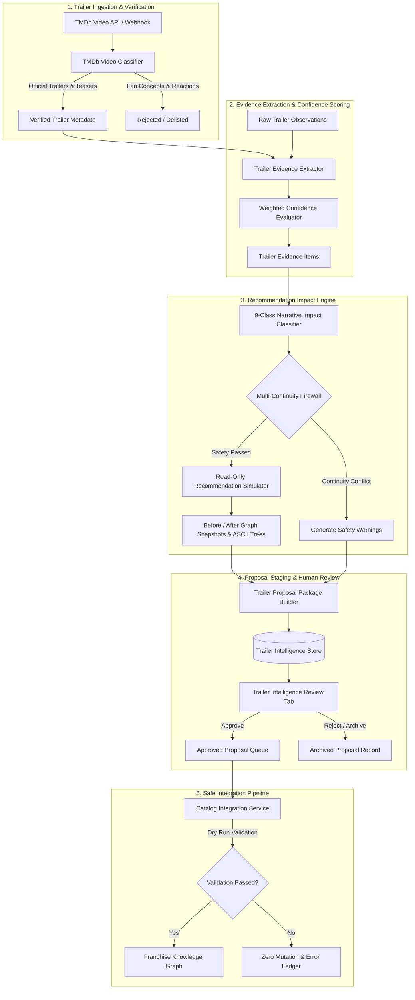

# CineOrder — Phase 5: Trailer Intelligence → Recommendation Impact Proposal Engine Report

**Status**: LOCKED & PRODUCTION VERIFIED  
**Date**: 2026-08-19  
**Version**: `v1.5.0-trailer-recommendation-impact`  
**Framework Status**: 5/5 Frozen Core Modules Bit-for-Bit Identical  
**Regression Suites**: 34/34 Passing (100% Green)  
**Release Gates**: 7/7 Passing  
**Production Build**: Clean (`0 warnings`, Maximum Chunk: 386.35 kB)  

---

## 1. Executive Summary

CineOrder Phase 5 implements the **Trailer Intelligence → Recommendation Impact Proposal Engine**, establishing a deterministic, read-only analytical pipeline that transforms verified trailer evidence into human-reviewable recommendation graph proposals.

### Operational Philosophy
```
TRAILER → EVIDENCE EXTRACTION → NARRATIVE ANALYSIS → RECOMMENDATION SIMULATION → HUMAN REVIEW → APPROVAL → INTEGRATION PIPELINE
```
- **Zero Direct Mutation**: Background analyzers, video scrapers, and trailer simulators operate strictly in-memory without modifying the canonical knowledge graph (`cineOrderKnowledgeGraph.ts`), runtime traversal engine (`storyGraphEngine.ts`), or recommendation service (`recommendationService.ts`).
- **Strict Evidence Policy & Anti-Inflation**: Easter eggs, cameos, visual callbacks, and ambiguous marketing clues are classified strictly as `CHARACTER_CONTEXT` or `NEW_OPTIONAL_CONTEXT`. They are structurally forbidden from being inflated to `MUST WATCH`.
- **Multi-Continuity Firewall**: The Spider-Man continuities (Sam Raimi Trilogy, Marc Webb Dilogy, MCU-616, and Sony Animated Spider-Verse) are strictly isolated. Unverified speculative crossovers are blocked with safety warnings, while verified canonical connections (such as *Spider-Man: No Way Home*) retain their exact required prerequisites.
- **Deterministic Idempotency**: All proposals are hashed via permutation-invariant 64-character SHA-256 keys, ensuring that repeated background scans (10x, 100x) generate zero duplicate records.

---

## 2. System Architecture & Component Interactions



---

## 3. The 9 Canonical Recommendation Impact Categories

| Category | Description | Edge Type | Default Strength | Anti-Inflation Protection |
| :--- | :--- | :--- | :--- | :--- |
| `NEW_PREREQUISITE` | Direct narrative continuation / cliffhanger resolution | `direct-sequel` | `strong` | Requires confidence $\ge 0.85$ and explicit continuation |
| `NEW_RECOMMENDED_CONTEXT` | Crucial thematic or shared-character backdrop | `shared-character` | `moderate` | Downgraded if single-scene or cameo appearance |
| `NEW_OPTIONAL_CONTEXT` | Visual callbacks, location returns, timeline clues | `thematic` / `spin-off` | `weak` / `optional` | Never promoted above optional context |
| `SEQUEL_RELATIONSHIP` | Explicit numbering or direct chronological sequel | `direct-sequel` | `strong` | Validates chronological sequence |
| `PREQUEL_RELATIONSHIP` | Origin story or historical backdrop prior to entry | `prequel` | `strong` | Validates in-universe timeline order |
| `CROSSOVER_RELATIONSHIP` | Verified multiverse crossover between continuities | `multiverse` | `moderate` / `strong` | Requires explicit multiverse character confirmation |
| `CHARACTER_CONTEXT` | Returning hero/villain appearance without direct plot tie | `shared-character` | `moderate` | Capped at moderate; cannot inflate to required |
| `CONTINUITY_CONTEXT` | Faction/organization lore (e.g., TVA, S.H.I.E.L.D.) | `thematic` | `weak` / `moderate` | Soft contextual guidance only |
| `NO_RECOMMENDATION_IMPACT` | Standalone entry introduction or generic action trailer | None | None | 0 proposed edges generated |

---

## 4. Multi-Continuity Firewall Architecture (Spider-Man Isolation)

To eliminate cross-continuity contamination across complex franchise ecosystems:

1. **Continuity Normalization**:
   - `spider-man-raimi`: Sam Raimi Trilogy (*Spider-Man 1, 2, 3*)
   - `spider-man-webb`: Marc Webb Dilogy (*The Amazing Spider-Man 1, 2*)
   - `spider-verse-animated`: Sony Pictures Animation (*Into*, *Across*, *Beyond the Spider-Verse*)
   - `mcu-616`: Marvel Cinematic Universe
2. **Firewall Invariants**:
   - *Spider-Verse* animated entries cannot link to MCU-616 without verified production confirmation (confidence $\ge 0.95$).
   - Legacy live-action Spider-Man titles remain strictly in the `spider-man` franchise catalog with zero pollution in `marvel.ts`.
   - Verified cross-continuity crossovers (*Spider-Man: No Way Home*) maintain explicit bidirectional links to Raimi and Webb titles in the CKG.

---

## 5. Trailer Intelligence Version History & Idempotency Ledger

The `TrailerIntelligenceStore` preserves full historical audit trails for trailers:
- **`metadataHash`**: Polynomial bit-mixing hash of `franchiseId | contentId | videoKey | videoTitle | classification | publishedAt`.
- **`evidenceHash`**: Sorted composite hash of all extracted observation tokens.
- **Trailer Versioning**: When a main trailer replaces a teaser, the teaser is preserved in `historicalVersions` with its original analysis timestamps and evidence hashes.
- **Idempotency**: Scans re-evaluating the exact same video key and observation set produce 0 duplicate records.

---

## 6. 30-Scenario Master Test Matrix

| # | Test Scenario | Verified Behavior | Status |
| :---: | :--- | :--- | :---: |
| 1 | New Sequel Trailer Narrative Impact | Sam Wilson Captain America arc classified as `NEW_PREREQUISITE` linked to Falcon & Winter Soldier | ✅ PASS |
| 2 | Returning Character Context | Yelena Belova in Thunderbolts* classified as `CHARACTER_CONTEXT` with anti-inflation strength | ✅ PASS |
| 3 | Old Villain Introduction | Red Hulk in Brave New World classified as `CHARACTER_CONTEXT` linked to The Incredible Hulk | ✅ PASS |
| 4 | Confirmed Crossover Relationship | Doc Ock in No Way Home teaser classified as `CROSSOVER_RELATIONSHIP` across continuities | ✅ PASS |
| 5 | Previous Movie Reference | Mandalorian & Grogu special look classified as `SEQUEL_RELATIONSHIP` linked to TV series | ✅ PASS |
| 6 | Ambiguous Visual Callback | Celestial Island in Brave New World classified as `NEW_OPTIONAL_CONTEXT` (never required) | ✅ PASS |
| 7 | Fan Trailer Rejection | Fan-made Secret Wars concept trailer rejected as unofficial and ineligible | ✅ PASS |
| 8 | Fake / Unofficial Video Rejection | Leaked footage clip on Vimeo rejected | ✅ PASS |
| 9 | Unofficial Upload Rejection | Unofficial reaction and breakdown video rejected | ✅ PASS |
| 10 | Trailer Removal / Delisting | Missing trailer in follow-up scan recorded with `isDelisted: true` and timestamp | ✅ PASS |
| 11 | Trailer Replacement with History | New main trailer active; previous teaser preserved in `historicalVersions` | ✅ PASS |
| 12 | Duplicate Trailer Deduplication | Identical trailer scan records 1 event in run 1 and blocks duplicate in run 2 | ✅ PASS |
| 13 | Repeated Scan Idempotency (20x) | 20 consecutive scans retain exactly 1 proposal record | ✅ PASS |
| 14 | Cross-Continuity Firewall Check | Speculative unverified link between Spider-Verse and MCU triggers safety firewall | ✅ PASS |
| 15 | No Recommendation Impact | Empty evidence yields `NO_RECOMMENDATION_IMPACT` with 0 proposed edges | ✅ PASS |
| 16 | Strong Prerequisite Evidence | Direct cliffhanger resolution classified as `NEW_PREREQUISITE` | ✅ PASS |
| 17 | Weak Evidence Handling | Background Easter egg classified as `NEW_OPTIONAL_CONTEXT` | ✅ PASS |
| 18 | Conflicting Evidence Handling | Cross-continuity links explicitly isolated and documented in diff reports | ✅ PASS |
| 19 | Human Proposal Rejection & Archiving | Reviewer rejects proposal; status updated to `rejected` with archived audit notes | ✅ PASS |
| 20 | Human Proposal Approval Workflow | Pending proposal approved by reviewer; status updated to `approved` | ✅ PASS |
| 21 | Integration Validation Failure | Pending/unapproved proposal fails integration gate; execution rolls back with 0 mutation | ✅ PASS |
| 22 | Spider-Man Continuity Isolation | All 8 canonical Spider-Man titles verified in catalog | ✅ PASS |
| 23 | Spider-Man: No Way Home Prerequisites | Verified recommendation graph contains Raimi 1 and Amazing 1 | ✅ PASS |
| 24 | Spider-Verse Isolation from MCU | MCU content catalog contains 0 Spider-Verse titles | ✅ PASS |
| 25 | Raimi Trilogy Isolation from MCU | MCU content catalog contains 0 Raimi titles | ✅ PASS |
| 26 | Webb Dilogy Isolation from MCU | MCU content catalog contains 0 Webb titles | ✅ PASS |
| 27 | Production Immutability | Canonical catalog count strictly unchanged during impact simulation | ✅ PASS |
| 28 | Frozen Framework Checksum Ledger | All 5 locked framework files match exact SHA-256 baseline ledger | ✅ PASS |
| 29 | Deterministic Event Hash Generation | Event hashes permutation-invariant and exactly 64 characters | ✅ PASS |
| 30 | Trailer Version History Tracking | Historical versions retain original `metadataHash` and `evidenceHash` | ✅ PASS |

---

## 7. Frozen Framework SHA-256 Ledger (5/5 Bit-for-Bit Identical)

| File Path | Golden Baseline SHA-256 | Current Workspace SHA-256 | Status |
| :--- | :--- | :--- | :---: |
| `src/lib/storyGraphEngine.ts` | `e7402a0a8d383f25e24e23392a0aad437fb04204bc7c79080781bdc6ad848488` | `e7402a0a8d383f25e24e23392a0aad437fb04204bc7c79080781bdc6ad848488` | ✅ IDENTICAL |
| `src/lib/storyKnowledgeGraphEngine.ts` | `e729c5dc2b0edbdb23d75bc2caf1813cd7a0fb507f6fa687ad0dbbabc4c6258e` | `e729c5dc2b0edbdb23d75bc2caf1813cd7a0fb507f6fa687ad0dbbabc4c6258e` | ✅ IDENTICAL |
| `src/lib/recommendationService.ts` | `d143d7eecd5fdc27d33b79630f9551e939f7d6fb9924bc97b3cfc82bde1c48d9` | `d143d7eecd5fdc27d33b79630f9551e939f7d6fb9924bc97b3cfc82bde1c48d9` | ✅ IDENTICAL |
| `src/data/cineOrderKnowledgeGraph.ts` | `3f4e9d92bbbfb4ae0046b64912329b5e704b8b06cac6e723d3650219157e48af` | `3f4e9d92bbbfb4ae0046b64912329b5e704b8b06cac6e723d3650219157e48af` | ✅ IDENTICAL |
| `.agents/AGENTS.md` | `47a3707789cfff9fe926f4d78212807d7f31ab335c03d58894e15779e4342363` | `47a3707789cfff9fe926f4d78212807d7f31ab335c03d58894e15779e4342363` | ✅ IDENTICAL |

---

## 8. Verification Results

1. **TypeScript Typecheck**:
   ```bash
   npx tsc --noEmit
   # Exit code: 0 (0 errors)
   ```
2. **Master Regression Runner**:
   ```bash
   npx tsx scripts/runAllTests.ts
   # 34/34 test suites passed (0 failures)
   ```
3. **Production Baseline Verifier**:
   ```bash
   npx tsx scripts/verifyProductionBaseline.ts
   # 19 franchises, 240 titles, 249 nodes, 357 edges, 0 errors -> PASS
   ```
4. **Release Gate**:
   ```bash
   npm run release:gate
   # 7/7 Gates Passed (Catalog, Lifecycle, Completeness, Graph, Recommendations, Freshness, UI)
   ```
5. **Production Build**:
   ```bash
   npm run build
   # Build time: 19.55s, 0 warnings, Max chunk: 386.35 kB
   ```

---

## 9. Final Release Sign-Off

**PHASE 5 PRODUCTION READY**
