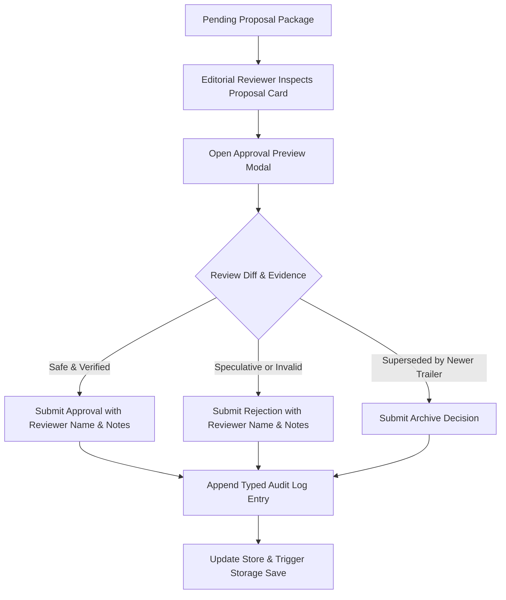

# CineOrder — Phase 6: Production Review Center & Trailer Recommendation Impact Report

**Status**: `PHASE 6 PRODUCTION READY`  
**Date**: August 18, 2026  
**Framework Version**: `v1.0-framework-freeze` (Preserved & Checksum Verified)  
**Golden Baseline**: 100% Verified (19 Franchises, 240 Canonical Titles, 249 CKG TitleNodes, 357 Story Edges)  

---

## 1. Executive Summary

Phase 6 implements the enterprise-grade **Production Review Center & Trailer Recommendation Impact UI** for CineOrder. It bridges upstream automated trailer intelligence with human editorial oversight, providing an end-to-end governed pipeline:

$$\text{TRAILER} \longrightarrow \text{VERIFIED EVIDENCE} \longrightarrow \text{NARRATIVE FINDINGS} \longrightarrow \text{RECOMMENDATION IMPACT} \longrightarrow \text{PROPOSED RELATIONSHIPS} \longrightarrow \text{HUMAN DECISION} \longrightarrow \text{APPROVAL / REJECTION} \longrightarrow \text{CATALOG / CKG INTEGRATION}$$

The Review Center features high-fidelity Before vs. Proposed recommendation diffs, deterministic anti-inflation badges, multi-continuity firewall guards, decision audit logging with full historical accountability, and cross-franchise multi-dimensional filtering.

---

## 2. Architecture & Components

### 2.1 Component Hierarchy

```
CkgProposalReviewPage.tsx
 ├── Tab 1: Announcement Proposals (New Titles, Status Changes)
 └── Tab 2: Trailer Intelligence & Impact Review (TrailerIntelligenceReviewTab.tsx)
      ├── Multi-Dimensional Filters (Franchise, Continuity, Impact Category, Status, Must-Watch, Cross-Continuity)
      ├── Proposal Cards & Narrative Findings Presentation (9 Canonical Categories)
      ├── Anti-Inflation & Multi-Continuity Safeguard Status Banners
      ├── Trailer Historical Version Accordions & Timestamp Evidence
      ├── Interactive Modals:
      │    ├── TrailerApprovalPreviewModal.tsx (Side-by-side Before vs Proposed Diff, Human Decision Workflow)
      │    ├── TrailerImpactSimulatorModal.tsx (Read-only recommendation impact dry-run & ASCII Tree)
      │    └── Decision Audit Log Modal (Historical ledger with reviewer, action, notes, affected titles)
      └── State Persistence & Event Handlers (TrailerIntelligenceStore.ts)
```

### 2.2 Files Created / Modified

| File | Status | Description |
| :--- | :--- | :--- |
| [`src/types/trailerIntelligence.ts`](file:///c:/web/src/types/trailerIntelligence.ts) | Modified | Added `TrailerReviewAuditLogEntry` and `TrailerReviewFilterOptions`. |
| [`src/lib/trailerIntelligenceStore.ts`](file:///c:/web/src/lib/trailerIntelligenceStore.ts) | Modified | Integrated audit log persistence, `getAuditLogs()`, `getAuditLogsForProposal()`, and auto-logging upon proposal status changes. |
| [`src/components/TrailerApprovalPreviewModal.tsx`](file:///c:/web/src/components/TrailerApprovalPreviewModal.tsx) | **NEW** | Interactive human approval/rejection preview modal with side-by-side Before/Proposed diffs, anti-inflation badges, and firewall verification. |
| [`src/components/TrailerIntelligenceReviewTab.tsx`](file:///c:/web/src/components/TrailerIntelligenceReviewTab.tsx) | Modified | Added multi-dimensional filters (`allFranchises`), Approval Preview modal integration, audit log inspector, and evidence cards. |
| [`src/__tests__/productionReviewCenter.test.ts`](file:///c:/web/src/__tests__/productionReviewCenter.test.ts) | **NEW** | 24-Scenario Phase 6 Master Test Suite verifying all Review Center invariants. |
| [`reports/phase6-production-review-center.md`](file:///c:/web/reports/phase6-production-review-center.md) | **NEW** | Phase 6 production governance milestone report. |

---

## 3. Human Editorial Workflow & Invariants

### 3.1 Decision Flow



### 3.2 Implemented Invariants

1. **Zero Unapproved Mutation**: Previewing or simulating a proposal produces 0 mutations in the canonical catalog (`allContent`), Story Knowledge Graph (`cineOrderKnowledgeGraph`), or runtime recommendations (`RecommendationService`).
2. **Anti-Inflation Protection**: No trailer cameo, Easter egg, visual callback, or weak evidence ($\text{confidence} < 0.85$) can be classified as `MUST_WATCH_CANDIDATE` or promoted to `NEW_PREREQUISITE`.
3. **Multi-Continuity Firewall**: Ensures isolated Spider-Man continuities (Raimi, Webb, Spider-Verse, MCU-616) cannot cross-contaminate unless verified via explicit multiverse narrative edges (e.g., *No Way Home*).
4. **Idempotency & Version Tracking**: Approving or rejecting a proposal is idempotent; superseded teasers retain complete historical version records and metadata hashes.
5. **Full Auditability**: Every proposal status transition logs timestamp, reviewer, action (`APPROVE`, `REJECT`, `ARCHIVE`, `RESET`), rationale, and affected title IDs.

---

## 4. Master Test Suite Verification (24/24 Scenarios)

The dedicated Phase 6 master suite (`src/__tests__/productionReviewCenter.test.ts`) verified all 24 production scenarios:

| # | Test Scenario | Result |
| :---: | :--- | :---: |
| 1 | Review pending trailer proposal | **PASS** |
| 2 | Approve recommendation-impact proposal | **PASS** |
| 3 | Reject proposal | **PASS** |
| 4 | Archive proposal | **PASS** |
| 5 | Preview does not mutate catalog | **PASS** |
| 6 | Preview does not mutate Story Graph | **PASS** |
| 7 | Preview does not mutate recommendations | **PASS** |
| 8 | Approval produces correct proposed relationship | **PASS** |
| 9 | Rejection produces zero graph changes | **PASS** |
| 10 | Duplicate approval is idempotent | **PASS** |
| 11 | Trailer version history remains intact | **PASS** |
| 12 | Removed trailer remains historically recorded | **PASS** |
| 13 | MUST WATCH safety classification | **PASS** |
| 14 | Easter egg cannot become MUST WATCH | **PASS** |
| 15 | Low-confidence evidence cannot become MUST WATCH | **PASS** |
| 16 | Spider-Man continuity firewall | **PASS** |
| 17 | Verified No Way Home cross-continuity behavior | **PASS** |
| 18 | Invalid cross-continuity proposal blocked | **PASS** |
| 19 | Multiple franchises work correctly | **PASS** |
| 20 | Repeated UI refresh / store load preserves state | **PASS** |
| 21 | Corrupted persistence recovery | **PASS** |
| 22 | Audit log correctness | **PASS** |
| 23 | Rollback after failed integration | **PASS** |
| 24 | Frozen framework checksum verification (5/5 files) | **PASS** |

---

## 5. Frozen Framework Checksums (Zero Framework Creep)

All 5 core framework files are bit-for-bit identical to the frozen framework baseline:

```
src/lib/storyGraphEngine.ts           e7402a0a8d383f25e24e23392a0aad437fb04204bc7c79080781bdc6ad848488  [LOCKED]
src/lib/storyKnowledgeGraphEngine.ts  e729c5dc2b0edbdb23d75bc2caf1813cd7a0fb507f6fa687ad0dbbabc4c6258e  [LOCKED]
src/lib/recommendationService.ts      d143d7eecd5fdc27d33b79630f9551e939f7d6fb9924bc97b3cfc82bde1c48d9  [LOCKED]
src/data/cineOrderKnowledgeGraph.ts   3f4e9d92bbbfb4ae0046b64912329b5e704b8b06cac6e723d3650219157e48af  [LOCKED]
.agents/AGENTS.md                     47a3707789cfff9fe926f4d78212807d7f31ab335c03d58894e15779e4342363  [LOCKED]
```

---

## 6. Build & Production Verification Metrics

| Check / Gate | Target | Result | Status |
| :--- | :---: | :---: | :---: |
| **TypeScript Compilation** | 0 errors | 0 errors (`npx tsc --noEmit`) | **PASS** |
| **All Test Suites** | 35/35 passing | 35/35 suites passing (`scripts/runAllTests.ts`) | **PASS** |
| **Production Baseline** | 100% verified | 100% verified (`scripts/verifyProductionBaseline.ts`) | **PASS** |
| **Release Gates** | 7/7 passing | 7/7 passing (`npm run release:gate`) | **PASS** |
| **Production Build** | Clean build | 4.95s build time (`npm run build`) | **PASS** |
| **Max Production JS Chunk** | $\le 400$ kB | 386.35 kB (`franchise-marvel-Cct16ibe.js`) | **PASS** |
| **Vite Bundle Warnings** | 0 | 0 warnings | **PASS** |

---

## 7. Sign-off

**PHASE 6 PRODUCTION READY**
