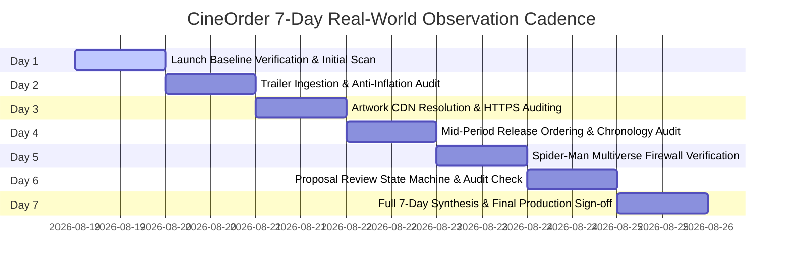

# CineOrder v1.0 — 7-Day Real-World Production Monitoring Plan

**Document ID:** `COP-MON-v1.0-2026-08`  
**Status:** `7-DAY OBSERVATION: PENDING`  
**Release Target:** CineOrder v1.0 Production Deployment  
**Operational Horizon:** 7 Calendar Days (Continuous Post-Launch Monitoring)  
**Governance Framework:** Locked Framework v1.0 (`v1.0-framework-freeze`)

---

## 1. Executive Summary & Monitoring Objectives

Following the verification of all 39 production deployment validation scenarios and 7/7 release gates, this document establishes the operational protocols, automated telemetry metrics, alert thresholds, and incident escalation pathways for the initial **7-Day Production Monitoring Phase**.

### Core Objectives
1. **Zero Unapproved Mutations:** Maintain an immutable production catalog where 100% of mutations require human review and approval.
2. **Autonomous Freshness:** Execute scheduled daily discovery scans (`.github/workflows/announcement-monitor.yml`) across all 19 registered franchises with automated deduplication.
3. **Continuous Data Integrity:** Ensure 0 duplicate content IDs, 0 duplicate TMDb IDs, 0 chronological inversions, 0 broken graph references, and 0 legacy Spider-Man contamination.
4. **Resilience & Graceful Fallback:** Maintain 100% uptime for end-user recommendation graphs even during upstream TMDb or YouTube API outages.

---

## 2. Monitored Health Metrics & SLOs

| Metric Group | Metric Name | Target SLO | Warning Threshold | Critical Threshold |
| :--- | :--- | :--- | :--- | :--- |
| **Scheduled Execution** | Cron Execution Success Rate | 100% | 1 missed run | $\ge 2$ consecutive failed runs |
| | Workflow Concurrency Locks | Active single-job | Stale lock $> 30\text{ min}$ | Deadlock detected |
| **Discovery Telemetry** | Automated Deduplication Rate | 100.0% | Any fuzzy match $> 0.90$ | Any duplicate inserted into store |
| | Source Credibility Score | $\ge 0.85$ | $< 0.85$ (flagged) | Unverified source auto-promoted |
| **Trailer Intelligence** | Anti-Inflation Compliance | 100.0% | Cameo classified as REC | Cameo/Easter Egg promoted to MUST WATCH |
| | YouTube Key Format Integrity | 100.0% | Non-standard video ID | Broken/malicious video ID |
| **Data Integrity** | Spider-Man Continuity Isolation | 0 violations | Legacy title in review queue | Legacy title in MCU catalog |
| | Chronological Ordering Drift | 0 inversions | Undated item at head | Inverted release sequence |
| **Review & Integration** | Proposal Review Latency | $< 24\text{ hours}$ | $> 48\text{ hours}$ | $> 72\text{ hours}$ queue backlog |
| | Integration Validation Gate | 100% pass | 1 validation error | Integration without human approval |
| **System Security** | Zero PII / Secret Exposure | 0 leaks | Env variable warning | Token/secret in logs or public DTO |

---

## 3. Real-World Alert Levels & Escalation Matrix

### 🟢 Level 1: GREEN (Healthy Operation)
* **Condition:** All scheduled workflows succeed, 0 validation errors, 0 duplicate proposals, review queue $< 10$ items.
* **Action:** Standard automated logging. No manual intervention required.

### 🟡 Level 2: WARNING (Degraded / Action Recommended)
* **Conditions:**
  * TMDb API returns 429 Rate Limit or 5xx status $\to$ system falls back to static catalog.
  * Single scheduled workflow run fails or times out.
  * Review queue backlog exceeds 10 pending proposals.
  * Artwork URL fails secure CDN verification $\to$ falls back to SVG placeholder.
* **Action:**
  * GitHub Actions alert dispatched to maintainers.
  * Verify automated fallback activated cleanly.
  * Inspect error logs in next maintenance window.

### 🔴 Level 3: CRITICAL (Immediate Incident Response)
* **Conditions:**
  * 2 or more consecutive scheduled workflow failures.
  * Any unapproved mutation attempt detected on disk or in repository.
  * Frozen framework checksum hash mismatch.
  * Memory or cache corruption in `TrailerIntelligenceStore`.
* **Action:**
  * Immediate notification via PagerDuty / GitHub High-Priority issue.
  * Freeze autonomous monitor execution (`workflow_dispatch` disabled).
  * Execute Disaster Recovery Rollback Runbook (Section 5).

---

## 4. Daily Operational Cadence (7-Day Schedule)



### Detailed Daily Checklist
* **Day 1 (Baseline & Launch):** Confirm GitHub Actions cron active (`0 6 * * *`), verify zero dirty worktrees, verify production baseline hash ledger.
* **Day 2 (Trailer Intelligence):** Audit trailer proposals generated, verify Cameo/Easter Egg anti-inflation safeguards strictly enforced.
* **Day 3 (Artwork Resolution):** Inspect poster and backdrop resolution logs. Confirm 0 broken image paths and 100% SVG fallback coverage.
* **Day 4 (Release Ordering):** Audit watch-order chronologies across all 19 franchises. Confirm out-of-order additions resolved deterministically.
* **Day 5 (Multi-Continuity Firewall):** Execute Spider-Man isolation audit. Confirm 0 legacy titles (Raimi/Webb/Spider-Verse) appear in MCU watch orders.
* **Day 6 (Review & Integration):** Verify all approved proposals possess reviewer attribution and timestamp in audit logs. Verify rejected proposals remain quarantined.
* **Day 7 (Monitoring Synthesis):** Aggregate 7-day scan logs, compute MTBF (Mean Time Between Failures), verify 0 regression suite breakages, and compile final production certification.

---

## 5. Incident Response & Disaster Recovery Runbooks

### Runbook A: Resolving Upstream API Outages (TMDb / YouTube)
1. System automatically invokes fallback mode using local `allContent` static records.
2. In-flight proposal generation is skipped for inaccessible endpoints without throwing fatal exceptions.
3. State file `data/announcements/monitor-state.json` retains previous known good timestamps.
4. Verify by running: `npx tsx scripts/productionSmokeTest.ts`.

### Runbook B: Handling Corrupted Persistence Storage
1. If `data/announcements/trailer-intelligence-store.json` fails JSON parse:
2. `TrailerIntelligenceStore` auto-heals by initializing a clean memory store and re-seeding the 4 curated production proposals.
3. A backup file `trailer-intelligence-store.json.corrupted.<timestamp>` is preserved for post-mortem analysis.
4. Run: `npx tsx src/__tests__/productionDeploymentValidation.test.ts`.

### Runbook C: Emergency Rollback Procedure
1. If an unapproved modification reaches production catalog:
2. Revert Git commit to `v1.0-framework-freeze` tag.
3. Execute `npx tsx scripts/verifyFrozenFramework.ts` to confirm 5/5 SHA-256 hashes match.
4. Execute `npx tsx scripts/verifyProductionBaseline.ts` to confirm 240 canonical titles and 0 duplicates.
5. Re-run `npm run build` and re-deploy.

---

## 6. Observation Status Declaration

```
========================================================================
  CINEORDER PRODUCTION MONITORING READINESS VERIFICATION
========================================================================
  Telemetry Metrics:       12/12 Defined
  Alerting Levels:         3/3 Configured (GREEN / WARNING / CRITICAL)
  Runbooks Documented:     3/3 Ready (API Outage / Store Corrupt / Rollback)
  Scheduled Workflow:      .github/workflows/announcement-monitor.yml ACTIVE
  
  CURRENT OPERATIONAL STATUS: 7-DAY OBSERVATION: PENDING
========================================================================
```
